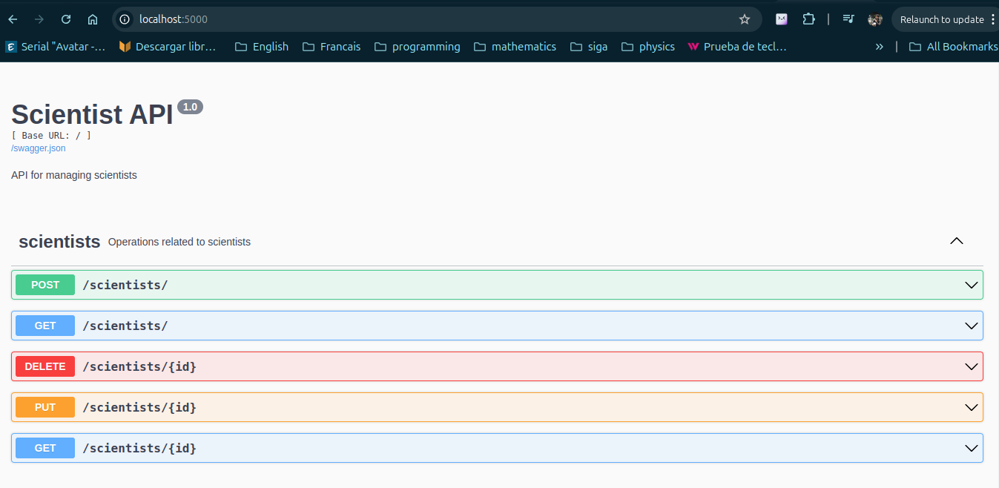

# Scientists Backend - Execution Instructions

This project is a Flask application that implements a REST API for managing scientists. It uses PostgreSQL as the database and Flask-RESTX for the API. The project also includes a Dockerfile and a Docker Compose file for easy deployment. 
---

## Running the Application

This option uses Docker to manage all services, including the database and the backend.

#### Environment Variables
- **DB_HOST**: `scientists-postgres-db`
- **DB_PORT**: `5432`

#### Steps:

1. Start the services with Docker Compose:
   ```bash
   docker compose -f ./docker-compose.dev.yml up --build
   ```
2. Start the application:
   ```bash
   localhost:5000
---

## Endpoints

Once the backend is running, the available endpoints can be explored through Swagger. To access the interactive documentation of the endpoints, open the corresponding URL in your browser.



---

## Additional Notes
- Make sure you have Docker, Docker Compose, and Poetry installed correctly on your system.
- The environment variables configuration is key to ensure that the services communicate correctly.
- The correction of any doubt or issue, consult the project documentation or contact the development team.


